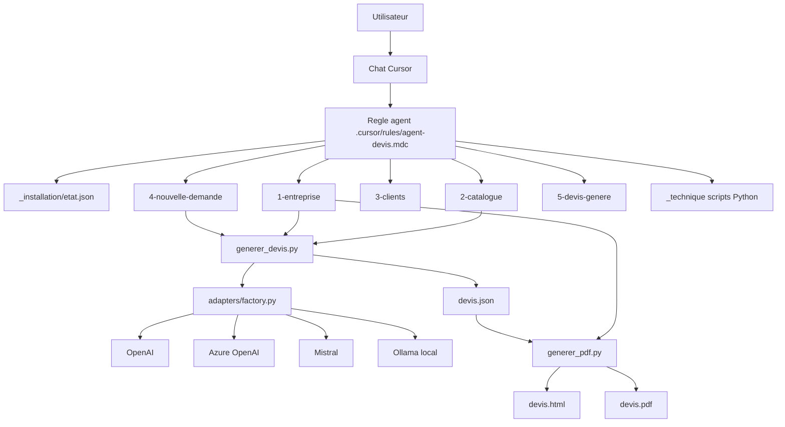

# Architecture du projet `ia-devis`

## Objectif

Ce projet permet a un utilisateur non technique de configurer son generateur de devis via une conversation avec l'agent, puis de produire des devis structurés et lisibles.

## Vue d'ensemble (diagramme)

## Description des flux

### 1) Flux d'installation initiale (one-shot)

1. L'utilisateur ouvre le projet et parle a l'agent.
2. L'agent lit `_installation/etat.json`.
3. Si `installation_terminee = false`, l'agent pose les questions de configuration une seule fois.
4. Les reponses alimentent progressivement :
   - `1-entreprise/identite.md`
   - `1-entreprise/mentions-legales.md`
   - `2-catalogue/services.json`
   - `2-catalogue/regles-tarification.md`
5. L'etat des etapes est marque dans `_installation/etat.json`.
6. Quand tout est complete, `installation_terminee` passe a `true`.

### 2) Flux de generation de devis

1. L'utilisateur fournit une demande client.
2. Le systeme combine :
   - contexte entreprise,
   - regles metier,
   - demande client.
3. Un devis structure est produit dans `5-devis-genere/devis.json`.
4. Le devis lisible est produit dans `5-devis-genere/devis.md`.
5. Avant export final, l'utilisateur valide les chiffres importants (prix, remise, total).
6. `generer_pdf.py` produit `devis.html` (et `devis.pdf` si dependances installees).

## Separation des responsabilites

- **Utilisateur metier**
  - Fournit les informations de base (entreprise, services, tarifs).
  - Valide les montants avant generation finale.
- **Agent (orchestration conversationnelle)**
  - Pose les questions dans le bon ordre.
  - Remplit les fichiers metier.
  - Ne repose pas les questions deja confirmees.
- **Fichiers metier**
  - Source de verite pour le contexte, le catalogue et les regles.
- **Scripts techniques**
  - `generer_devis.py` : construit la sortie structuree.
  - `generer_pdf.py` : met en forme et exporte.

## Zones IA vs zones deterministes

### Zones IA

- Interpretation de la demande client.
- Selection des prestations pertinentes.
- Formulation des hypotheses quand une information manque.
- Interaction conversationnelle avec l'utilisateur.

### Zones deterministes

- Structure des fichiers et chemins.
- Calcul/affichage des montants a partir des donnees de reference.
- Validation explicite avant generation finale.
- Production des fichiers de sortie (`json`, `md`, `html`, `pdf`).
- Validation de schemas (`schemas/*.json`) en CI.

## Contrats de donnees (schemas)

- `schemas/services.schema.json` : valide la structure du catalogue.
- `schemas/devis.schema.json` : valide la structure d'un devis genere.
- CI execute automatiquement la validation des schemas a chaque push.

## Justification des choix d'architecture

- **Organisation par dossiers numerotes (`1-...` a `5-...`)**
  - Rend le projet lisible pour un profil non technique.
- **Regle Cursor unique always-apply**
  - Assure un comportement stable de l'agent entre sessions.
- **Etat d'installation persistant (`_installation/etat.json`)**
  - Evite les questions repetitives et rend le parcours fluide.
- **Separation metier / technique**
  - Les utilisateurs modifient surtout les dossiers metier.
  - Les scripts restent isoles dans `_technique`.
- **Sorties multi-formats**
  - `json` pour la structure, `md/html/pdf` pour la lecture et le partage.
